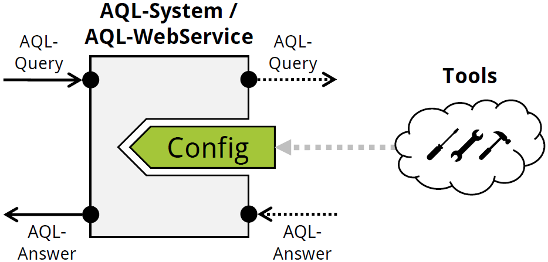

---

	 
	WebService

# AQL-WebService
The *Android App Analysis Query Language WebService (AQL-WebService)* is a wrapper for [AQL-Systems](https://github.com/FoelliX/AQL-System).
It makes an AQL-System accessible over the Internet by allowing access through an REST API.
In this regard, networks of analysis tools can be build by coupling one or more frontends with arbitrary many AQL-WebServices.
AQL-WebServices can also be chained as indicated in the figure below.
One example for such a analysis tool network is known as [CoDiDroid](https://github.com/FoelliX/CoDiDroid).

	

## Example
Any AQL-System wrapped in an AQL-WebService can be configured the usual way (See [configuration tutorial](https://github.com/FoelliX/AQL-System/wiki/Configuration)).
To access the tools configured in an AQL-WebService the configuration associated with the frontend has to specify the webservice as an external tool as explained in the tutorial.

## Configuration, Launch Parameters and Runtime Commands
Any AQL-WebService must be configured by the parameters in its `config.properties` file.
The following table explains each of these parameter:

| Entry | Meaning |
| ----- | ------- |
| `aqlPath = /path/to/aql` | Defines the path to the directory where the underlying AQL-System's storage or temp files etc. should be stored. |
| `timeout = 20m` | Defines how long to wait for an answer. Three different units can be used (`s`: seconds, `m`: minutes, `h`: hours). |
| `preferLoading = false` | Sets the preferLoading option of the underlying AQL-System (Default: `false`). |
| `queueStart = 10000` | Determines the first id that will be associated with the first query received. Thereafter it is increased with each query. |
| `allowedURLs = http://localhost` | Defines which remote host are allowed to issue queries to this webservice (Separator: `,`). |
| `username = aql`, `password = AQL-P4SSw0rd` | Credentials required to access this webservice. |
| `port = 8080` | Definition of the port to listen on. |
| `bufferTime = 1000` | Time in milliseconds to collect incoming queries before transferring them to the underlying AQL-System. Required to allow parallel question answering. |

Once an AQL-WebService is configured, certain launch parameters can be used to further influence its execution.
The table below explains the available launch parameters:

| Parameter	 | Meaning |
| ---------- | ------- |
| `-config "X"`, `-cfg "X"`, `-c "X"` | By default the `config.xml` file in the tool’s directory is used as configuration. With this parameter a different configuration file can be chosen. `X` has to reference the path to and the configuration file itself. |
| `-debug "X"`, `-d "X"` | The output generated during the execution of this tool can be set to different levels. `X` may be set to: `error`, `warning`, `normal`, `debug`, `detailed` (ascending precision from left to right). Additionally it can be set to `short`, the output will then be equal to `normal` but shorter at some points. By default it is set to `normal`. |
| `-backup`, `-b` | When this launch parameter is provided, the current storage of the underlying AQL-System is backed up on start. |
| `-reset`, `-r` | By this parameter the storage of the underlying AQL-System is resetted on start. Whenever a backup is scheduled as well, it will be generated before the reset. |

When the AQL-WebService is up and running the following commands can be used to perform the associated actions:

| Command | Action |
| ------- | ------ |
| `help` | Shows a list of available commands and other helpful information. |
| `exit`, `quit` | To stop the webservice. |
| `change port %PORT%` | The port, to which the webservice is listening to, is changed to %PORT% (e.g. `change port 8081`). |
| `change username %USERNAME%`, `change password %PASSWORD%` | The credentials to access the webservice are changed (e.g. `change username aqlUser` or `change password S3cR3T!`). |
| `save` | Stores the current settings in the "config.properties" file. |
| `info` | Shows some basic information. |
| `tools` | Shows a list of all tools in the current config. |
| `backup` | Backups the underlying AQL-System's storage. |
| `reset` | Resets the underlying AQL-System. |

## Publications
- *Together Strong: Cooperative Android App Analysis* (Felix Pauck, Heike Wehrheim)  
ESEC/FSE 2019 [https://dl.acm.org/citation.cfm?id=3338915](https://dl.acm.org/citation.cfm?id=3338915)

## License
The AQL-WebService is licensed under the *GNU General Public License v3* (see [LICENSE](https://github.com/FoelliX/AQL-WebService/blob/master/LICENSE)).

## Contact
**Felix Pauck** (FoelliX)  
Paderborn University  
fpauck@mail.uni-paderborn.de  
[http://www.FelixPauck.de](http://www.FelixPauck.de)

## Links
- CoDiDroid, an analysis tool network build out of AQL-WebServices: [https://github.com/FoelliX/CoDiDroid](https://github.com/FoelliX/CoDiDroid)
- AQL-System, the system wrapped in AQL-WebServices, which can also be used as a frontend interface: [https://github.com/FoelliX/AQL-System](https://github.com/FoelliX/AQL-System)
- BREW, a frontend implementation for benchmark execution: [https://github.com/FoelliX/BREW](https://github.com/FoelliX/BREW)
- AQL-Online, a website which can be used as frontend, too.